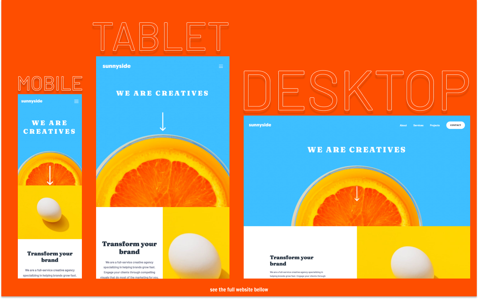

# Frontend Mentor - Sunnyside Agency Landing Page solution

This is a solution to the [Sunnyside Agency Landing Page Challenge on Frontend Mentor](PROJECT LINK).

## Table of contents

- [Overview](#overview)
  - [The challenge](#the-challenge)
  - [Screenshot](#screenshot)
  - [Links](#links)
- [My process](#my-process)
  - [Built with](#built-with)
  - [What I learned](#what-i-learned)
  - [Continued development](#continued-development)
  - [Useful resources](#useful-resources)
- [Author](#author)

## Overview

### The challenge

Users should be able to:

- View the optimal layout for the site depending on their device's screen size
- See hover states for all interactive elements on the page

### Screenshot

### Links

- Live Site URL: [TO_BE_UPDATED](TO_BE_UPDATED)
- Solution URL: [TO_BE_UPDATED](TO_BE_UPDATED)

## My process

### Built with

- Semantic HTML5 markup
- SCSS custom properties
- CSS Flexbox
- CSS Grid
- Vanilla JS
- Mobile-first workflow

### What I learned

This was the first big project in Frontend Mentor, and I can proudly say that I like how it came out. Since the whole project was based on CSS Grid, there were so many ways to build the layout. I chose to build small blocks, and use BEM's power to use the same styling for the remaining blocks. Overall, really colorful and cool project that was another opportunity to practice CSS Grids.

### Continued development

I built a mobile responsive navbar here for the first time, and I have to admit it was easier than I thought it would be. What I plan on doing is to try to make the navbar more interactive with some animations.

### Useful resources

- [Navbar Hover Effect](https://codepen.io/kens-visuals/pen/WNEJKqz) - Since there was no hover effect on the top navbar, I decided to come up with my own. This is the link to Codepen if you want to see the implementation.
- If I need to reference anything about CSS Grid, these are my favorite ones to go to:
  - [https://grid.malven.co/](https://grid.malven.co/)
  - [https://yoksel.github.io/grid-cheatsheet/](https://yoksel.github.io/grid-cheatsheet/)

## Author

- Frontend Mentor - [@kens-visuals](https://www.frontendmentor.io/profile/kens-visuals)
- Codewars - [@kens_visuals](https://www.codewars.com/users/kens_visuals)
- CodePen - [@kens-visuals](https://codepen.io/kens-visuals)
